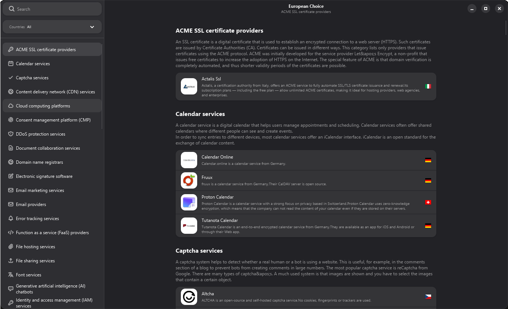

# European Choice

A GTK desktop catalog browser for discovering European software alternatives and promoting digital sovereignty.



## Requirements

- CMake (version 3.15 or higher)
- Rust toolchain (2024 edition)
- GTK4 (version 4.10 or higher)
- Libadwaita (version 1.6 or higher)
- GLib schema compilation tools

## Building

### Prerequisites

**Linux:**
- CMake
- Rust toolchain
- GTK4 development libraries
- Libadwaita development libraries
- pkg-config

**Windows:**
- CMake
- Rust toolchain
- GTK4 dependencies (automatically downloaded via gvsbuild)

### Compilation

```bash
# Clone the repository
git clone https://github.com/timarques/european-choice.git
cd european-choice

# Create build directory
cmake -B build
cmake --build build
cmake --install build --prefix /path/to/install
```